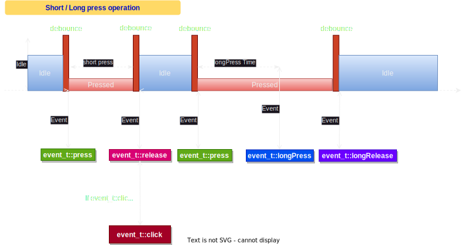
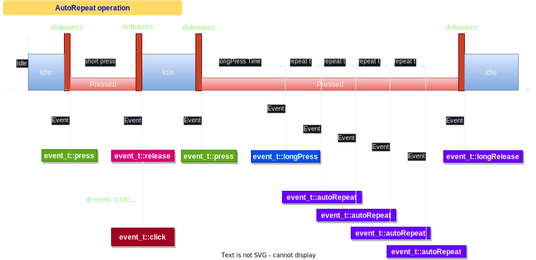
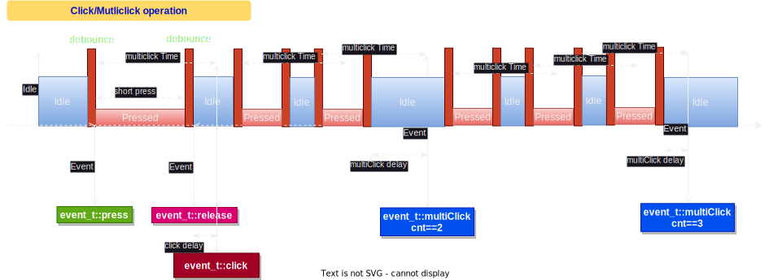

# ESPAsyncButton

__[EXAMPLES](/examples/) |__ 

Event-based asynchronous button library for the ESP32 arduino/IDF

This project has started as a fork of [rwmingis/InterruptButton](https://github.com/rwmingis/InterruptButton) - a really nice lib for ESP32 interrupt based buttons. But then I reworked it down to scratch to implement a set of classes for versatile button management for ESP32 family chips. It uses event-driven approach to register, transfer an handle button events. Utilizing RTOS features and HW timers event handling is fully asynchronous and decoupled from gpio ISRs. It allows to build flexible event-drivent derivatives for asynchronous, thread-aware projects.

## Features:

 * GPIO-based momentary buttons with/without debouncing
 * Interrupts + HW timers are used to register button press/release and generate events
 * gpio's ISRs and event processing are _decoupled_ from each other, i.e. it is possible to handle multiple gpios from a single callback-handler
 * this library does NOT call any user callback code in ISRs, event processing are handled in separate RTOS thread depending on Policy
 * button event propagation and handling via [ESP Event loop](https://docs.espressif.com/projects/esp-idf/en/stable/esp32/api-reference/system/esp_event.html)
 * selectable button behavior
    - defaults are generating `press`/`release` events
    - `longPress`, `longRelease` events could be enabled on button hold
    -   `AutoRepeat` events while button is on hold
    -   `Click`, `MultiClick` events for any number of consecutive short clicks counting
 * policy-based class templates to easy integrate user-defined event handler policies
 * an easy-to-use all-in-one [Async Event Button](/examples/00_AsyncEventButton) class with callbacks

## Operation states

Depending on enabled event types button generates events when switching between logical states.
Following diagrams could help to understand it better.

### Short/Long press events

By default only two events are enabled for GeneralButton object:
 - `ESPButton::event_t::press`   - generated each time button was pressed
 - `ESPButton::event_t::release` - generated each time button was released

If `LongPress`/`LongRelease` events were enabled, then each time button is pressed a timer is started with timeout `TimeOuts::longPress` ms. If this timer expires before button is released, then an event `ESPButton::event_t::longPress` is generated. Then, if longPress was triggered, on button release `ESPButton::event_t::longRelease` event will be generated instead of `ESPButton::event_t::release`.

Timeline events diagram:

### Autorepeat event

Autorepeat event generation might be enabled to generate events periodically while button is kept in pressed state. I.e. to repeat some action like if the button was continously pressed and released multiple times.
This could be used for scrolling, step-by-step increments, etc...

Timeline events diagram:

### Click/MultiClick events

Click/Multiclick events are enabled disabled independently. `ESPButton::event_t::click` is just a short press/release and it is generated on button 'release'.  `MulttiClicks` could be enabled if you need to differentiate events like 2 or more consecutive key press/release counts.
Once single click is complete, button waits for `TimeOuts::multiClick` ms, if no more consecutive clicks where performed then multiclick event is generated with additional counter value. Any number of consecutive clicks could be executed.
> [!NOTE]
> Long button press does _not_ generate `ESPButton::event_t::click` event.

Timeline events diagram:

#### Thanks
Thanks to [R. Mingis](https://github.com/rwmingis) for his original lib and inspiration for this project.

